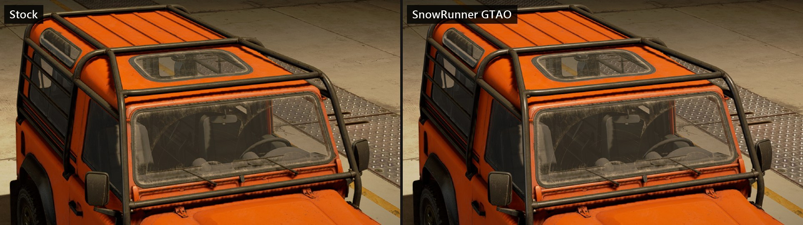
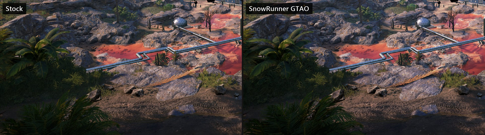

# SnowRunner GTAO

Better soft shadows for SnowRunner.

Ambient occlusion is the soft shadow where things meet: under a truck, between tyres, in corners. SnowRunner's version is a depth-only SSAO from the late 2000s: 8 samples on a fixed kernel, with a radius that covers the same share of the screen at any distance. It draws a dark outline along every edge and lays a grey film over flat ground, whether anything is close or not. This mod replaces that shader with ground truth ambient occlusion (GTAO): it looks along several directions on screen, finds the horizon the depth buffer leaves open and darkens only by the sky that is really blocked. Edges and open ground come out clean, and the shading that remains sits where geometry closes in: between twin tyres, inside a frame, where a wheel meets the ground. The radius is set in metres, so the effect keeps its size whether a truck is next to the camera or across the valley.

It works without ReShade or any other loader. The shader goes into the game's own shader cache inside `shader.pak`, and the game runs it as its own.





## Install

1. Close SnowRunner.
2. Run `SnowRunnerGTAO.exe`. Windows shows "Windows protected your PC" the first time, because the program is not signed: click More info, then Run anyway.
3. The program finds the game through Steam, Epic Games or the Microsoft Store. If it does not, click Browse and pick `shader.pak` in the game folder under `preload\paks\client`.
4. Click Install. It takes a few seconds.
5. Start the game. Ambient occlusion has to be on in the video settings (any quality; the setting still picks full or half resolution).

## Remove

Run the program again and click Remove. It puts the original `shader.pak` back, byte for byte, from the backup it made.

If the backup is gone, the store can restore the file. Steam: right click SnowRunner, Properties, Installed Files, Verify integrity of game files. Epic: Library, the three dots on SnowRunner, Manage, Verify.

## After a game update

A game update or the store's file check replaces `shader.pak` with the original. The mod is then simply not installed any more: run the program again and click Install.

If an update ever changes the game's ambient occlusion shader, the program says so and changes nothing. Look for a newer version of the mod then.

## What it changes

One file: `preload\paks\client\shader.pak` in the game folder. Two shaders inside it are swapped, the full resolution and the half resolution SSAO pass. Nothing else in the game folder is touched, and no file is left behind there.

The backup of the original file and a small list of installs live in `%LOCALAPPDATA%\SnowRunnerGTAO`. Remove deletes the backup once the original is back in place.

The program refuses to write when the game is running, when the file is not a SnowRunner `shader.pak`, when the ambient occlusion shaders in it are neither the game's originals nor this mod's, or when disk space is short. Every new file is written next to the old one, read back and checked before it takes the old one's place.

## Notes

- Cost: the shader reads depth 64 times per pixel where the stock pass reads it 8 times. On a slow GPU, set the game's ambient occlusion quality lower: that switches the pass to half resolution.
- It is a visual change on your machine only. Co-op has not been tested.
- ReShade and other overlays keep working. Tools that replace the game's SSAO shader by hash will no longer find it while this mod is installed.

## Build

Windows 10 or 11 with the Windows SDK (for `fxc.exe`). The C# compiler that ships with Windows builds the installer.

```
powershell -NoProfile -ExecutionPolicy Bypass -File build.ps1
powershell -NoProfile -ExecutionPolicy Bypass -File test\run_tests.ps1 -OriginalPak "<game>\preload\paks\client\shader.pak"
```

The tests run the installer's command line form on scratch copies in the temp folder: install, install twice, remove, remove twice, lost backup, a file that is no pak, a cut off pak, a write Windows refuses, and the game running. They need an unpatched `shader.pak`; no game file is part of this repository.

## How it works

`shader.pak` is a plain zip with stored entries, zero padded to a 4096 byte multiple. Its entry `shadercachedx11.sdc` is a 12 byte header (date stamp, packed size, unpacked size) and one zlib stream. Unpacked, the cache is a list of include files, a program count, a shader count, that many size prefixed DXBC shaders, and a program table that refers to shaders by index. Because the table uses indices, a shader may change size. The installer finds the two SSAO generation shaders by the resource names in their reflection data, checks by CRC-32 that they are the game's originals (or an earlier version of this mod), swaps them, packs the cache again and rewrites the zip entry with its checksum, sizes and directory.

The shader keeps the original's contract: the same constant buffers, textures, sampler array and signatures, by name and slot (`src\shader\gtao.hlsl`). The pass gets no projection constants from the engine, so the field of view is assumed, as the original shader does.

## Licence and credits

GNU General Public License v3.0 (GPL-3.0-only), see `LICENSE`.

The method is ground truth ambient occlusion by Jorge Jimenez, Xian-Chun Wu, Angelo Pesce and Adrian Jarabo ("Practical Real-Time Strategies for Accurate Indirect Occlusion", 2016). The horizon integration follows Intel's XeGTAO by Filip Strugar and Steve Mccalla (MIT); its notice is in `THIRD_PARTY_NOTICES.md`.

SnowRunner is a game by Saber Interactive. This project is not affiliated with Saber Interactive or Focus Entertainment and contains no game files.
